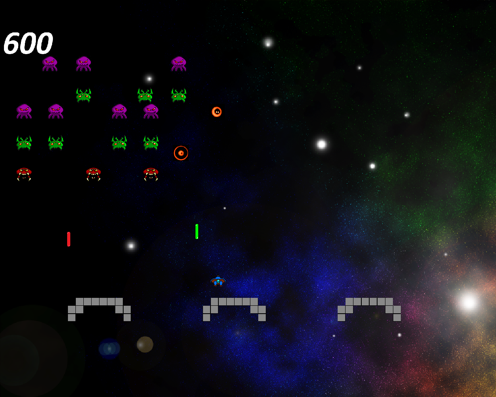

Tutorial from [https://app.pluralsight.com/library/courses/game-maker-studio-making-first-game-2419]()

Note: This tutorial was created using v1.4 and using Drag and Drop. I've used v2 and GML (code).

Here is a screenshot: 

TODOs:
<li>figure out how to get_string_async() for high score since get_string() is deprecated
<li>deal with having ship not scroll to top (from bottom)
<li>ships after they scroll past the bottom of the screen
<li>create levels programatically (maybe)
<li>work on collision control of everything
<li>more levels (maybe)
